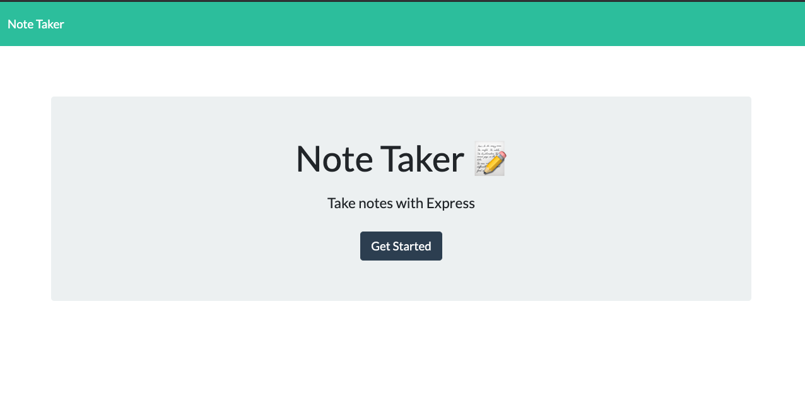
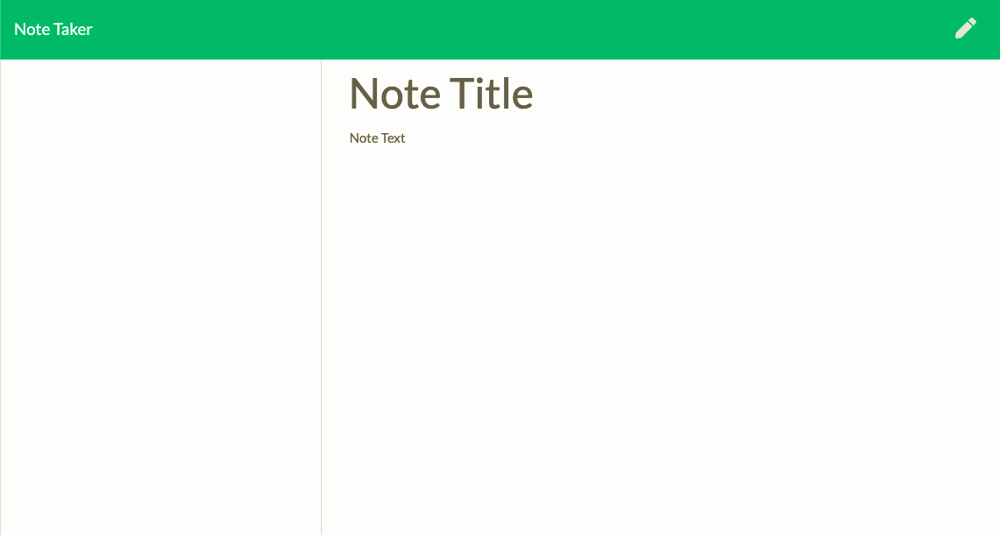

# NoteTaker

 Repo that allows you to take notes as well as save and delete them.

As a habitual note taker, I want a note taking app, to easily jot down things I need to remember on a daily basis as well as be able to delete them when needed.

This is the starting page of the Note-Taker.

Here you will see the notetaking page.

Here you will find an example of how the page should work

